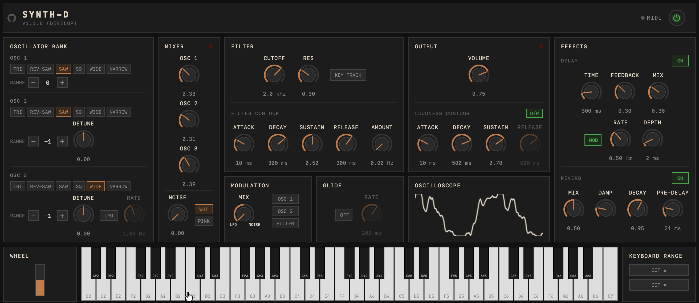

# SYNTH-D



<p align="center"><a href="https://davidirvine.github.io/synth-d/">try it out</a></p>

A browser-based subtractive synthesizer inspired by the Moog Model D, built with Svelte 5 and a FAUST DSP engine compiled to WebAssembly.

---

## Features

- **3 oscillators** with 6 waveforms each: triangle, reverse-saw, sawtooth, square, wide pulse, narrow pulse
- **OSC3 as LFO** — switchable between audio-rate oscillator and low-frequency modulation source
- **Moog ladder filter** with ADSR envelope and keyboard tracking
- **Amplitude envelope** (ADSR) with decay/release lock
- **Modulation** — OSC3 or noise routed to OSC1 pitch, OSC2 pitch, or filter cutoff, with mod wheel depth
- **Glide** (portamento) with variable rate
- **Tape delay** with time, feedback, and mix; includes a subtle wow LFO for analog character
- **Freeverb reverb** with pre-delay, decay, and LPF tone control
- **Oscilloscope** — live waveform display via Web Audio `AnalyserNode`
- **MIDI input** via Web MIDI API — notes, pitch bend, CC, and per-knob MIDI learn (right-click any knob)
- **On-screen keyboard** playable with mouse or touch

---

## Architecture

### DSP (`faust/synth.dsp`)

The entire signal path is written in [FAUST](https://faust.grame.fr/) and compiled to a WebAssembly AudioWorkletNode at build time. Parameters are exposed as named `hslider`/`nentry` controls and set from JavaScript via `node.setParamValue()`.

Signal chain summary:

1. **Oscillators** — three independent oscillators with octave range controls; OSC2 and OSC3 add cent-level detune; OSC3 can be switched to LFO mode
2. **Modulation** — OSC3 signal (or white noise) scaled by the mod wheel routes to OSC1 pitch, OSC2 pitch, and/or filter cutoff
3. **Mixer** — OSC1 + OSC2 + OSC3 (audio mode only) + white/pink noise with independent level knobs
4. **Moog ladder filter** (`ve.moog_vcf`) — ADSR envelope, key tracking, and modulation input all sum into the cutoff frequency
5. **VCA** — ADSR amplitude envelope with optional decay/release lock
6. **Tape delay** — feedback path through a 6 kHz LPF and `tanh` saturation; a 0.5 Hz wow LFO modulates delay time for analog drift
7. **Freeverb reverb** (`re.mono_freeverb`) — pre-delay, decay, LPF tone, and dry/wet mix; all parameters smoothed to prevent zipper noise

### UI (`src/`)

Built with **Svelte 5** (runes API) and bundled with **Vite**. `App.svelte` is the single root component; it owns all reactive state and routes parameter changes from each panel component down to the audio engine via `setParam()`. MIDI learn state is also managed here — right-clicking any `Knob` component enters learn mode for that parameter.

### MIDI (`src/audio/midi.js`, `src/audio/midiCcMap.js`)

`MidiManager` wraps the Web MIDI API and dispatches note-on/off, pitch-bend, and CC events. `MidiCcMap` stores CC-to-parameter assignments and handles scaling from the 0–127 CC range to each parameter's native range. CC 1 (mod wheel) is hard-wired; all other CCs are assignable via MIDI learn.

---

## Development

### Prerequisites

| Tool         | Purpose                                        |
| ------------ | ---------------------------------------------- |
| Node.js ≥ 20 | build and dev server                           |
| FAUST        | DSP compilation to WASM (`faust:build` script) |

```sh
npm install
```

### Scripts

| Command                 | Description                                                             |
| ----------------------- | ----------------------------------------------------------------------- |
| `npm run dev`           | Start Vite dev server                                                   |
| `npm run build`         | Production build to `dist/`                                             |
| `npm run faust:build`   | Recompile `faust/synth.dsp` → `public/synth.wasm` + `public/synth.json` |
| `npm test`              | Run Vitest unit and component tests                                     |
| `npm run test:coverage` | Vitest with V8 coverage                                                 |
| `npm run mutate`        | Stryker mutation testing (target: ≥ 85 %)                               |
| `npm run test:e2e`      | Playwright end-to-end tests                                             |
| `npm run lint`          | ESLint                                                                  |
| `npm run format`        | Prettier                                                                |

> The WASM artefacts (`public/synth.wasm`, `public/synth.json`) are pre-built and committed. Only run `faust:build` when `faust/synth.dsp` changes.

### Branching & Deployment

| Branch      | Role                                                         |
| ----------- | ------------------------------------------------------------ |
| `main`      | Trunk. Deploys automatically to GitHub Pages on every merge. |
| `feature/*` | New capability branches, cut from `main`.                    |
| `bugfix/*`  | Fix branches, cut from `main`.                               |

**CI checks on PRs to `main`:** tests, lint, and format must all pass.

**Production deploy:** merging to `main` triggers a GitHub Actions workflow that builds `dist/` and publishes it to GitHub Pages.

**PR previews:** every open pull request gets a preview deployment at `https://davidirvine.github.io/synth-d/pr-preview/pr-<N>/`.

**Releases:** `release-please` tracks commits on `main`, bumps the version in `package.json`, and opens a release PR. Merging that PR creates a git tag, a `CHANGELOG.md` entry, and a GitHub Release.

---

## Project Workflow

This project uses a spec-driven, AI-assisted development workflow:

- **OpenSpec** — every change starts with a spec proposal (`/opsx:propose`). Implementation only begins after the spec is approved.
- **roborev** — an AI code review daemon runs after every commit. Open findings are addressed with `/roborev-fix` before a section can be closed.
- **stax** — all branch management and PR creation goes through `stax`. A single PR is opened per feature/bugfix branch when the entire change is complete.
- **Husky hooks** — pre-commit (lint/format) and post-commit (roborev review trigger) run automatically.

See [CLAUDE.md](CLAUDE.md) for the full mandatory workflow rules.

---

## Tech Stack

| Layer                  | Technology                          |
| ---------------------- | ----------------------------------- |
| UI framework           | Svelte 5 (runes)                    |
| Bundler                | Vite 8                              |
| DSP language           | FAUST                               |
| DSP runtime            | WebAssembly via `@grame/faustwasm`  |
| Audio API              | Web Audio API (`AudioWorklet`)      |
| MIDI                   | Web MIDI API                        |
| Unit / component tests | Vitest + Testing Library            |
| Mutation tests         | Stryker                             |
| End-to-end tests       | Playwright                          |
| Linting                | ESLint + `eslint-plugin-svelte`     |
| Formatting             | Prettier + `prettier-plugin-svelte` |
| Git hooks              | Husky                               |
| Branch / PR management | stax                                |
| Code review            | roborev                             |
| Change workflow        | OpenSpec                            |
